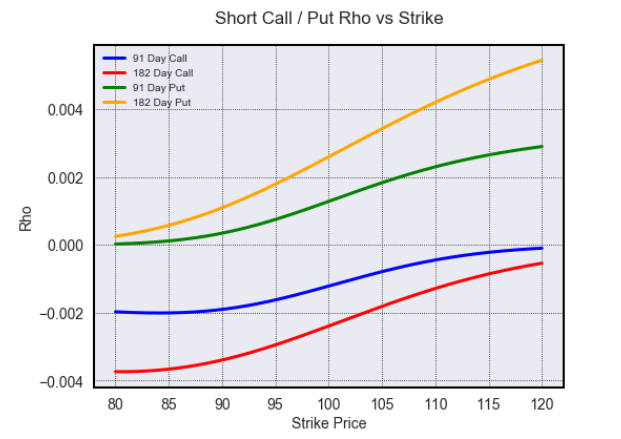

# optionpricer
## Option pricing, risk and visualisation tools

A tool to calculate option prices and sensitivities and visualize these. 
Each of the functions comes with default parameters so it can be run without arguments for ease of illustration or they can be specified individually

### Black-Scholes option pricing and sensitivities:
  - Price: option price 
  - Delta: sensitivity of option price to changes in asset price
  - Gamma: sensitivity of delta to changes in asset price
  - Vega: sensitivity of option price to changes in volatility
  - Theta: sensitivity of option price to changes in time to maturity
  - Rho: sensitivity of option price to changes in the risk free rate
  - Vomma: sensitivity of vega to changes in volatility; Volga
  - Vanna: sensitivity of delta to changes in volatility / of vega to changes in asset price
  - Charm: sensitivity of delta to changes in time to maturity aka Delta Bleed
  - Zomma: sensitivity of gamma to changes in volatility
  - Speed: sensitivity of gamma to changes in asset price; 3rd derivative of option price wrt spot
  - Color: sensitivity of gamma to changes in time to maturity; GammaTheta
  - Ultima: sensitivity of vomma to changes in volatility; 3rd derivative of option price wrt volatility
  - Vega Bleed: sensitivity of vega to changes in time to maturity

### 2D greeks graphs:
#### Charts of 3 options showing price, vol or time against:
  - option value
  - delta
  - gamma
  - vega
  - theta

#### Long Call Delta vs Price

#### Long Call Theta vs Price

#### Charts of 4 options showing price, strike and vol against rho
#### Short Rho vs Strike

### 3D greeks graphs:
#### Each of the greeks above can be plotted showing Time to Expiration against Strike or Volatility
#### Using matplotlib: 

#### Long Vega

#### Short Gamma

#### Or using plotly display a graph that can be rotated and zoomed:
#### Long Call Price

#### Long Put Price against Volatility

#### Long Vanna

#### Short Zomma
 

### Option strategy Payoff graphs:
  - call / put
  - stock
  - forward
  - collar 
  - call / put spread
  - backspread
  - ratio vertical spread
  - straddle
  - strangle
  - butterfly
  - christmas tree
  - iron butterfly
  - iron condor

#### Short Call:

#### Long Straddle:

#### Short Christmas Tree:

The following volumes served as a reference for the formulas and charts:
* [The Complete Guide to Option Pricing Formulas, 2nd Ed, E. G. Haug]
* [Option Volatility & Pricing, S. Natenburg]
  
[The Complete Guide to Option Pricing Formulas, 2nd Ed, E. G. Haug]:<https://www.amazon.co.uk/Complete-Guide-Option-Pricing-Formulas/dp/0071389970/>
[Option Volatility & Pricing, S. Natenburg]:<https://www.amazon.co.uk/Option-Volatility-Pricing-Strategies-Techniques/dp/155738486X/>
